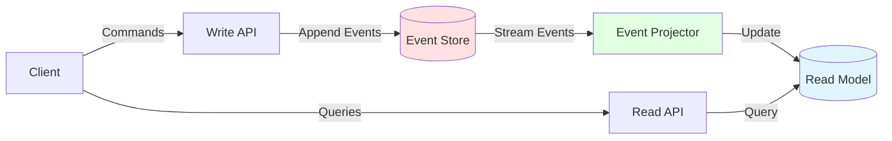
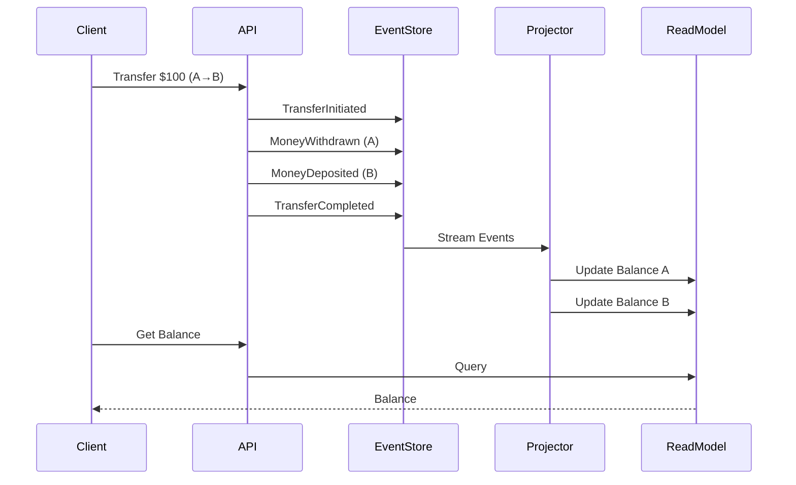
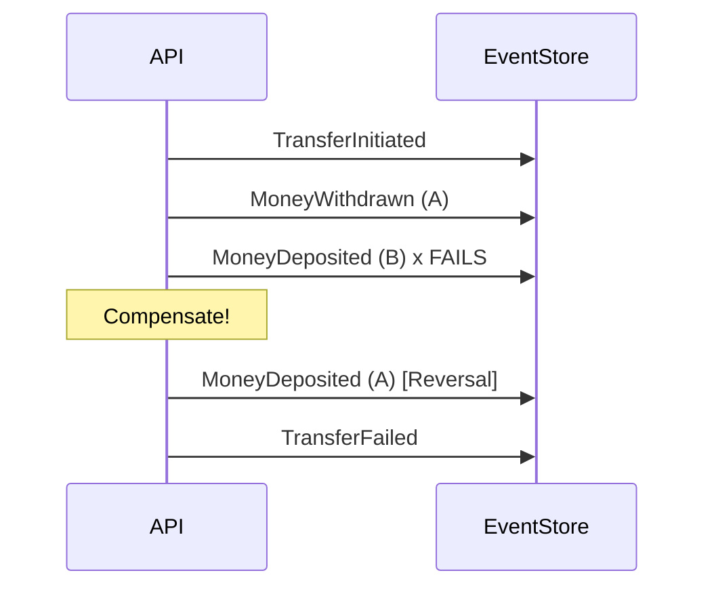

# Double-Entry Financial Ledger Service

> Event-sourced payment ledger implementing double-entry accounting principles — the same financial integrity model used by M-Pesa, Stripe, and Monzo.

## Overview

An immutable, event-sourced ledger system where every transaction is an append-only domain event. Balances are derived by replaying events, ensuring complete audit trails and the ability to reconstruct state at any point in time.

## Features

### Core Functionality
- **Immutable Event Store:** Append-only event log, never update or delete
- **CQRS Pattern:** Separate write model (events) from read model (balances)
- **Double-Entry Accounting:** Every debit has a corresponding credit
- **Transfer Saga:** Distributed transaction pattern with compensating actions
- **Optimistic Locking:** Prevents double-spending under concurrent load
- **Event Replay:** Rebuild read model from event store at any time
- **Reconciliation:** Detect drift between event store and read model

### Production Ready
- Event versioning for schema evolution
- Idempotent event processing
- Snapshot support for performance
- Complete audit trail
- Transaction history API
- Docker Compose setup

## Tech Stack

- **Framework:** Spring Boot 3.2, Spring Data JPA, Spring Events
- **Database:** PostgreSQL 16 (event store + read model)
- **Testing:** JUnit 5, Testcontainers
- **DevOps:** Docker, Gradle

## Quick Start

```bash
# Clone repository
git clone https://github.com/Khin-96/financial-ledger-service.git
cd financial-ledger-service

# Start PostgreSQL
docker-compose up -d

# Run application
./gradlew bootRun

# Access Swagger UI
open http://localhost:8081/swagger-ui.html
```

## Architecture



## Core Concepts

### Event Sourcing

Instead of storing current state, we store all events that led to that state:

**Traditional Approach (BAD):**
```sql
UPDATE accounts SET balance = balance - 100 WHERE id = 1;
-- Lost: Who made the change? When? Why? Can't undo.
```

**Event Sourcing (GOOD):**
```sql
INSERT INTO ledger_events (account_id, event_type, amount, timestamp)
VALUES (1, 'MONEY_WITHDRAWN', 100, NOW());
-- Preserved: Complete history, can replay, can audit
```

### CQRS (Command Query Responsibility Segregation)

**Write Side (Commands):**
- Create account
- Deposit money
- Withdraw money
- Transfer funds

**Read Side (Queries):**
- Get balance
- Get transaction history
- Get account statement

### Double-Entry Accounting

Every transaction affects at least two accounts:

```
Transfer $100 from Account A to Account B:
  1. Debit Account A: -$100
  2. Credit Account B: +$100
  
Sum of all debits = Sum of all credits (always balanced)
```

## API Endpoints

### Account Management
```http
POST   /api/accounts              - Create new account
GET    /api/accounts/{id}         - Get account details
GET    /api/accounts/{id}/balance - Get current balance
GET    /api/accounts/{id}/events  - Get event history
```

### Transactions
```http
POST   /api/transactions/deposit   - Deposit funds
POST   /api/transactions/withdraw  - Withdraw funds
POST   /api/transactions/transfer  - Transfer between accounts
GET    /api/transactions/{id}      - Get transaction status
```

### Admin
```http
POST   /api/admin/projections/rebuild  - Rebuild read model
GET    /api/admin/projections/lag      - Check projection lag
POST   /api/admin/reconcile            - Reconcile accounts
```

## Example: Transfer Saga



### Failure Handling (Compensating Transaction)



## Event Store Schema

```sql
CREATE TABLE ledger_events (
    id          UUID PRIMARY KEY,
    account_id  UUID NOT NULL,
    event_type  VARCHAR(50) NOT NULL,
    amount      DECIMAL(19,4),
    currency    VARCHAR(3),
    metadata    JSONB,
    occurred_at TIMESTAMP NOT NULL,
    version     BIGINT NOT NULL,
    UNIQUE(account_id, version)
);
```

**Key Points:**
- Append-only (no UPDATE or DELETE)
- Version column for optimistic locking
- JSONB metadata for flexibility
- Indexed by account_id and version

## Read Model Schema

```sql
CREATE TABLE account_balances (
    account_id    UUID PRIMARY KEY,
    balance       DECIMAL(19,4) NOT NULL,
    currency      VARCHAR(3) NOT NULL,
    last_event_id UUID,
    updated_at    TIMESTAMP
);
```

**Key Points:**
- Materialized view of current state
- Can be rebuilt from events
- Optimized for queries

## Optimistic Locking

Prevents double-spending under concurrent load:

```java
// Thread A and B both try to withdraw from same account
// Only one succeeds, the other gets version conflict

INSERT INTO ledger_events (account_id, version, ...)
VALUES (:accountId, :expectedVersion + 1, ...)
-- Unique constraint on (account_id, version) ensures atomicity
```

## Event Replay

Rebuild read model from scratch:

```java
@Transactional
public void rebuildProjections() {
    // 1. Clear read model
    balanceRepository.deleteAll();
    
    // 2. Replay all events in order
    List<LedgerEvent> events = eventRepository.findAllByOrderByOccurredAt();
    
    // 3. Apply each event
    for (LedgerEvent event : events) {
        projector.project(event);
    }
}
```

## Testing

```bash
# Run all tests
./gradlew test

# Run integration tests with Testcontainers
./gradlew integrationTest

# Test concurrent withdrawals
./gradlew test --tests ConcurrencyTest
```

### Example Test: Prevent Double-Spend

```java
@Test
void shouldPreventDoubleSpend() throws Exception {
    UUID accountId = createAccount(1000.00);
    
    // Two threads try to withdraw $600 each
    CompletableFuture<Void> thread1 = CompletableFuture.runAsync(() -> 
        withdraw(accountId, 600.00)
    );
    CompletableFuture<Void> thread2 = CompletableFuture.runAsync(() -> 
        withdraw(accountId, 600.00)
    );
    
    // Wait for both
    CompletableFuture.allOf(thread1, thread2).join();
    
    // Only one should succeed
    BigDecimal balance = getBalance(accountId);
    assertThat(balance).isEqualTo(new BigDecimal("400.00"));
}
```

## Why This Matters

### For Fintech Companies (Stripe, M-Pesa, Monzo)

1. **Audit Trail:** Every transaction is preserved forever
2. **Debugging:** Can replay events to reproduce bugs
3. **Compliance:** Regulators require complete transaction history
4. **Reconciliation:** Can detect and fix discrepancies
5. **Time Travel:** Query balance at any point in history

### For Interviews

This project demonstrates:
- **Event Sourcing:** Industry-standard pattern for financial systems
- **CQRS:** Separation of concerns for scalability
- **Saga Pattern:** Distributed transaction management
- **Concurrency Control:** Optimistic locking prevents race conditions
- **Domain-Driven Design:** Rich domain model with events

## Key Design Decisions

### Why Event Sourcing?

**Problem:** Traditional UPDATE loses history
```sql
UPDATE accounts SET balance = 500 WHERE id = 1;
-- What was the previous balance? Who changed it? Why?
```

**Solution:** Append-only events
```sql
INSERT INTO ledger_events (event_type, amount, ...) VALUES ('DEPOSITED', 500, ...);
-- Complete history preserved, can replay, can audit
```

### Why CQRS?

**Problem:** Balance queries are 100x more frequent than writes

**Solution:** Separate read and write models
- Write model: Optimized for consistency (event store)
- Read model: Optimized for queries (materialized balances)
- Scale independently

### Why Optimistic Locking?

**Problem:** Two concurrent withdrawals can overdraw account

**Solution:** Version-based concurrency control
```java
// Each event has a version number
// Database enforces UNIQUE(account_id, version)
// Second transaction fails with constraint violation
```

## Deployment

### Docker
```bash
./gradlew bootBuildImage
docker run -p 8081:8081 financial-ledger-service:1.0.0
```

### Kubernetes
```bash
kubectl apply -f k8s/
```

## Documentation

- [DESIGN.md](./DESIGN.md) - Architecture decisions
- [API.md](./docs/API.md) - Complete API reference
- [TESTING.md](./docs/TESTING.md) - Testing strategy

## References

- [Event Sourcing by Martin Fowler](https://martinfowler.com/eaaDev/EventSourcing.html)
- [CQRS Pattern](https://martinfowler.com/bliki/CQRS.html)
- [Saga Pattern](https://microservices.io/patterns/data/saga.html)

## License

MIT License - See [LICENSE](LICENSE) file for details

## Contact

Chris Kinga Hinzano  
Email: hinzanno@gmail.com  
GitHub: [@Khin-96](https://github.com/Khin-96)  
Portfolio: [hinzano.dev](https://hinzano.dev)
